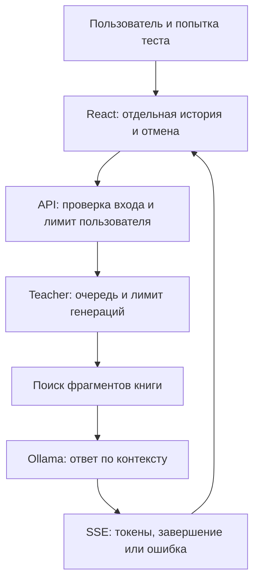

# D4Tech — сайт и ИИ-преподаватель

Репозиторий содержит React-интерфейс (`frontend/`), основной FastAPI API (`backend/`), внутренний сервис преподавателя (`teacher/teacher_service/`) и конфигурации развёртывания. Изменения этой поставки относятся к учебному модулю. Почтовая интеграция, 1С и данные пользователей не мигрируются.

## Исправления учебного модуля — 10 сентября 2026

| Проблема | Изменение | Проверка |
|---|---|---|
| Повторное прохождение использовало историю предыдущего разбора | У результата появился `attemptId` (UUID); история и состояние открытия чата привязаны к попытке и пользователю | Разные пользователи/попытки получают разные ключи; повреждённая история отбрасывается |
| Новый вопрос попадал в prompt дважды | Контекст формируется до сохранения нового вопроса; в него входят только предыдущие свободные реплики текущей попытки | Не более 6 реплик, по 1000 символов; новый вопрос передаётся отдельно |
| Частичный ответ мог выглядеть как успешный | SSE-парсер проверяет завершающее событие, JSON и UTF-8; клиент Ollama проверяет `done` | Обрывы, разрезанные байты, CRLF, ошибки и завершение пачки |
| Запросы продолжались после закрытия разбора | `AbortController`; поздние ответы не записываются в историю другого пользователя | Проверены серверное освобождение слота и чистые функции изоляции; браузерная приёмка отдельно |
| Разбор множественного выбора учитывал только один вариант | Передаются все правильные и выбранные ответы; старые поля сохранены для совместимости | Валидация индексов и prompt с несколькими ответами |
| Несколько пользователей конкурировали за модель без достаточного контроля | Ограниченная очередь teacher, таймаут ожидания и выполнения; в API один активный/ожидающий запрос на пользователя в процессе | 8 параллельных HTTP-запросов с имитатором модели, отмена, перегрузка и ошибка |
| Поиск только по смыслу мог пропускать технические обозначения | Dense-поиск + BM25 + Reciprocal Rank Fusion | Детерминированные тесты идентификаторов, кириллицы и слияния |
| Источник фрагмента терялся | Имя PDF, физическая страница, PDF page label, раздел оглавления, SHA-256 книги | Проверка различения физической страницы и метки |

Это исправления обнаруженных дефектов кода. Конкретная причина ошибки на рабочем сервере **не подтверждена журналами production**. Нельзя считать любой HTTP 200 доказательством завершённой генерации: SSE может передать ошибку после начала ответа.

**Простыми словами:** у каждого прохождения теперь собственная тетрадь. Старую тетрадь не подмешиваем в новую, текущий вопрос не переписываем дважды. Общая модель обслуживает ограниченное число запросов, а незаконченный ответ не выдаётся за готовый.

## Как это работает



История хранит до 100 завершённых объяснений и 40 последних сообщений диалога на попытку в localStorage; это не серверное хранилище и не синхронизация между устройствами. Старый общий ключ не используется. При закрытии чата текущая генерация отменяется; при открытии запрашиваются оставшиеся ошибки. После сбоя доступна кнопка повтора. Первичный разбор отправляется пачками по 20 вопросов, последовательно. Уже законченные сообщения сохраняются; последнее сообщение при обрыве может потребовать повторной генерации.

Ограничение 6000 символов истории — ограничение размера запроса, **не точный токен-бюджет**. Для русского текста 6000 символов не равны 6000 токенам. Контекст книги и ответ также занимают окно модели. Настройку `OLLAMA_NUM_CTX` нужно принимать после измерений на реальной модели; значения по умолчанию не являются обещанием достаточного окна для любого разрешённого запроса.

## Что прочитать дальше

- [Исследование RAG, архитектурные решения и план качества](docs/teacher-rag-design.md).
- [Проверки, внедрение, ограничения и откат](docs/teacher-validation-rollout.md).
- [Запуск внутреннего teacher](teacher/README.md).

## Проверки разработчика

Из корня репозитория:

```bash
npm ci --prefix frontend
node --test frontend/tests/*.test.mjs
npm run build --prefix frontend
uv sync --frozen --project teacher
uv run --project teacher python -m pytest teacher/tests
```

Для Node-тестов нужен Node 24 (встроенное чтение TypeScript). Серверные тесты не требуют настоящей Ollama, GPU, PostgreSQL или секретов production. Они проверяют протокол и изоляцию с имитатором модели, но не педагогическую достоверность её ответов. CI повторяет сборку и тесты с lock-файлами.
