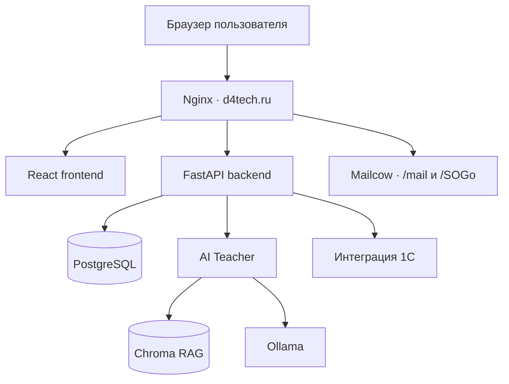
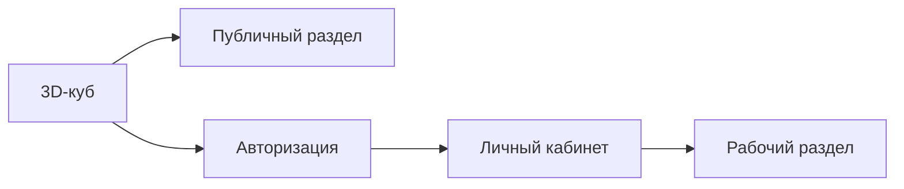
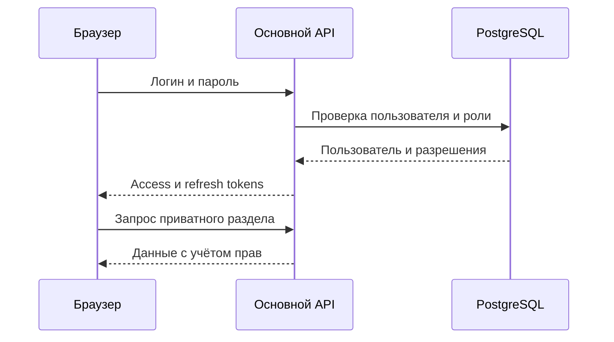
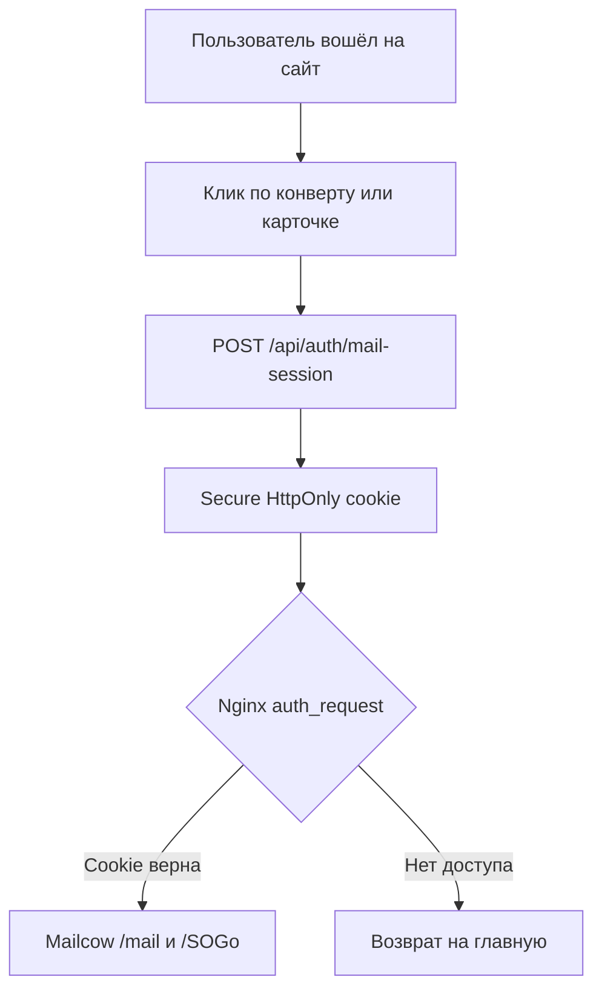
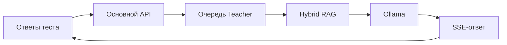
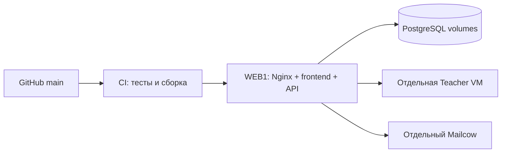

# D4Tech — сайт, личный кабинет и ИИ-преподаватель

Корпоративный веб-портал ООО «Д4 Технологии». Репозиторий объединяет публичный сайт с интерактивным 3D-кубом, личный кабинет сотрудников, основной API, внутренний AI Teacher и production-конфигурации.

Этот README — короткая карта проекта для быстрого знакомства. Детали AI/RAG и внедрения вынесены в документы из раздела [«Где искать подробности»](#где-искать-подробности).

## Система в одном рисунке



- **Frontend** показывает публичные разделы, форму входа и личный кабинет.
- **Backend** отвечает за пользователей, права, склад, документы, расходы и доступ к Teacher.
- **Teacher** ищет контекст в технической литературе и передаёт его локальной LLM.
- **Mailcow** остаётся отдельной почтовой системой, доступной через защищённый шлюз сайта.
- **PostgreSQL и Docker volumes** содержат рабочие данные и не должны заменяться при обычном деплое.

## Разделы сайта

### Публичная часть

Главная страница — интерактивный куб. Все переходы сходятся в один диспетчер навигации в `frontend/src/app/AppRoot.tsx`.

| URL | Грань/раздел | Назначение |
|---|---|---|
| `/` | Куб | Главная навигация |
| `/login` | Авторизация | Вход и регистрация |
| `/about` | О нас | Компания, партнёры и сертификаты |
| `/services` | Решения и услуги | Направления и предложения компании |
| `/software` | Программное обеспечение | Собственные программные решения |
| `/support` | Поддержка | Обращение за поддержкой |
| `/contacts` | Контакты | Контактная информация |
| `/legal` | Правовая информация | Реквизиты, документы и технологии |

### Личный кабинет

Неавторизованный переход в приватный раздел приводит на `/login`.

| URL/переход | Раздел | Основная функция |
|---|---|---|
| `/dashboard` | Кабинет | Карточки доступных сервисов |
| `/learning` | Обучение | Тесты и объяснения AI Teacher |
| `/warehouse` | Склад | Товары, перемещения и синхронизация с 1С |
| `/docs` | Документы | Корпоративные файлы |
| `/finance` | Финансы | Чеки и командировочные расходы |
| `/admin` | Администрирование | Пользователи и роли; скрытый маршрут с проверкой прав |
| `/mail` | Почта | Внешний Mailcow в новой вкладке; это маршрут Nginx, а не React-страница |

## Основные пользовательские цепочки

### Обычная навигация



Адресная строка синхронизируется собственным лёгким роутером `frontend/src/lib/router.tsx`. `react-router-dom` намеренно не используется.

### Авторизация и приватные данные



Frontend хранит основную пользовательскую сессию и автоматически обновляет access token. Backend остаётся источником истины: скрытие кнопки в интерфейсе не заменяет серверную проверку роли.

### Защищённый вход в почту



Прямое знание адреса `/mail` не должно открывать почту. Frontend сначала получает короткоживущий почтовый пропуск у API, а Nginx проверяет его перед каждым маршрутом Mailcow. Конфигурационный пример: `deploy/nginx-mail-auth.conf.example`.

### Тест и объяснение AI Teacher



Каждая попытка теста имеет отдельный `attemptId`; история другой попытки или пользователя не подмешивается. Teacher использует dense-поиск, BM25 и Reciprocal Rank Fusion, затем формирует ответ по найденным фрагментам. Одновременные генерации ограничиваются очередью.

## Карта репозитория

```text
frontend/   React 19, TypeScript, Vite, Tailwind — весь интерфейс
backend/    FastAPI, SQLAlchemy, Alembic — основной API и бизнес-логика
teacher/    FastAPI, Chroma, Ollama — внутренний AI/RAG-сервис
deploy/     Docker Compose и примеры production-конфигурации Nginx
docs/       Архитектурные решения, RAG и порядок безопасного внедрения
.github/    CI-проверки GitHub Actions
```

Точки входа:

- `frontend/src/app/AppRoot.tsx` — состояние приложения и общий диспетчер переходов;
- `frontend/src/data/navigation/` — грани куба, страницы и карточки кабинета;
- `backend/src/main.py` — подключение маршрутов основного API;
- `backend/src/routes/` — auth, admin, warehouse, documents, expenses, teacher;
- `teacher/teacher_service/main.py` — внутренний Teacher API;
- `deploy/docker-compose.prod.yml` — PostgreSQL, мигратор и основной API;
- `teacher/docker-compose.ai.yml` — Teacher и индексатор RAG.

## Поток данных и ответственность

| Область | Кто обслуживает | Где хранятся данные |
|---|---|---|
| Пользователи и роли | Backend | PostgreSQL |
| Склад и синхронизация 1С | Backend + планировщик | PostgreSQL |
| Документы | Backend | `documents_data` |
| Чеки и расходы | Backend | PostgreSQL + `expenses_data` |
| История текущего разбора теста | Frontend | localStorage, отдельно по пользователю и попытке |
| RAG-индекс | Teacher | `teacher_chroma` |
| Почта | Mailcow | Собственное хранилище Mailcow |

## Локальная проверка

Требования: Node.js 24, Python 3.12 и [uv](https://docs.astral.sh/uv/).

```bash
# Frontend
npm ci --prefix frontend
node --test frontend/tests/*.test.mjs
npm run build --prefix frontend

# Teacher
uv sync --frozen --project teacher
uv run --project teacher python -m pytest teacher/tests
```

Запуск frontend для разработки:

```bash
npm run dev --prefix frontend
```

Запуск основного API без Docker:

```bash
uv sync --frozen --project backend
uv run --project backend uvicorn src.main:app --app-dir backend --reload
```

Секреты и production-файлы `.env.production` / `.env.ai` в Git не добавляются. Используйте соответствующие example-файлы и собственные значения.

## Общая схема production



Безопасный порядок обновления:

1. создать резервные образы/каталоги;
2. собрать новую версию;
3. выполнить Alembic;
4. переключить API и дождаться healthcheck;
5. атомарно заменить `frontend/dist`;
6. проверить сайт, API и зависимые сервисы;
7. только после этого удалять старые releases.

Не удаляйте и не пересоздавайте production volumes при обычном обновлении. В них находятся PostgreSQL, документы, расходы и RAG-индекс.

## Где искать подробности

- [Архитектура RAG и принятые решения](docs/teacher-rag-design.md)
- [Проверки, внедрение и откат Teacher](docs/teacher-validation-rollout.md)
- [Запуск AI Teacher](teacher/README.md)
- [Пример защиты почтового шлюза](deploy/nginx-mail-auth.conf.example)

## Правило для следующего разработчика

Перед изменением определите владельца логики:

- отображение и переходы — `frontend/`;
- права и бизнес-правила — `backend/`;
- поиск по книгам и генерация — `teacher/`;
- публичные маршруты и reverse proxy — Nginx/`deploy/`;
- постоянные данные — PostgreSQL и именованные Docker volumes.

Изменение считается завершённым только после теста своего компонента и проверки всей пользовательской цепочки, которую оно затрагивает.
